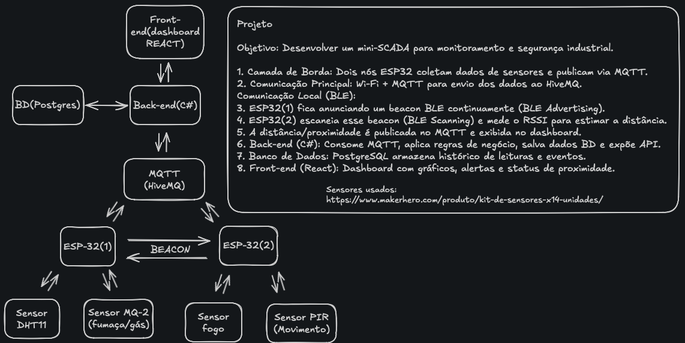

# Mini-SCADA: Monitoramento Ambiental e Segurança Industrial

Projeto prático de um sistema SCADA em miniatura, desenvolvido para monitorar variáveis ambientais e de segurança utilizando nós de borda (Edge Computing), comunicação sem fio híbrida (Wi-Fi + BLE) e uma arquitetura baseada em microsserviços.

## 🎯 Objetivo
Desenvolver um sistema completo de hardware e software usado para monitorar, controlar e registrar dados de processos industriais, integrando sensores físicos, comunicação MQTT/BLE e um dashboard de supervisão em tempo real.

## 🏗️ Arquitetura e Comunicação

### Camada de Borda (Edge / Sensores)
*   **Nó 1 - ESP32 (Ambiente):** Coleta dados do Sensor DHT11 (Temperatura/Umidade) e Sensor MQ-2 (Fumaça/Gás inflamável). Publica os dados via rede Wi-Fi utilizando o protocolo **MQTT**. Também atua como um transmissor BLE contínuo (**BLE Advertising / Beacon**).
*   **Nó 2 - ESP32 (Segurança):** Coleta dados do Sensor de Fogo (Chama) e Sensor PIR (Movimento). Opera como **BLE Scanner**, medindo o sinal RSSI do Nó 1 para estimar a distância (proximidade) entre eles. Publica seus sensores físicos e os dados do Beacon via MQTT.

### Camada de Mensageria
*   **Broker MQTT (HiveMQ / Mosquitto):** Roteador central que recebe os tópicos dos ESP32 e distribui para os serviços inscritos.

### Camada de Backend e Dados
*   **Backend (C# .NET):** Worker/API que assina os tópicos MQTT, processa as mensagens, aplica as regras de negócio de automação e expõe endpoints para o frontend.
*   **Banco de Dados (PostgreSQL):** Responsável por persistir o histórico de leituras (séries temporais) e o log de eventos/alertas.

### Camada de Supervisão
*   **Frontend (React):** Dashboard interativo que consome a API do backend para exibir gráficos, status de proximidade e alertas críticos de segurança.

## 🚀 Tecnologias Utilizadas
*   **Embarcados:** C/C++ (ESP32), BLE (Bluetooth Low Energy)
*   **Mensageria:** MQTT (HiveMQ)
*   **Backend:** C# (.NET Core / Web API)
*   **Frontend:** React.js
*   **Banco de Dados:** PostgreSQL